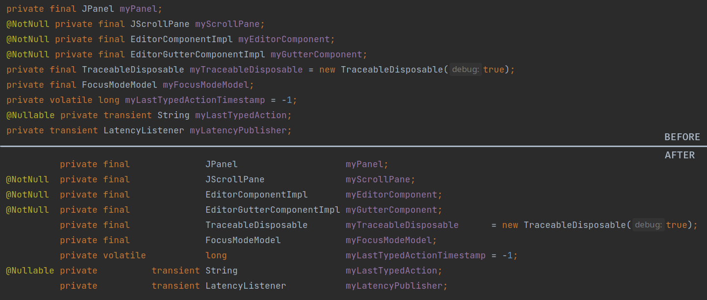
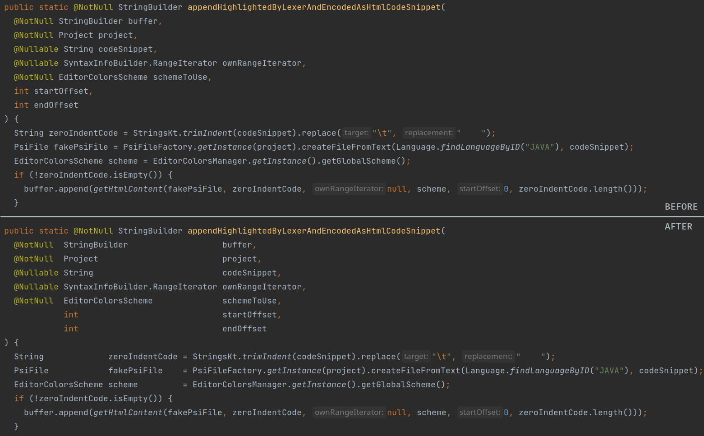
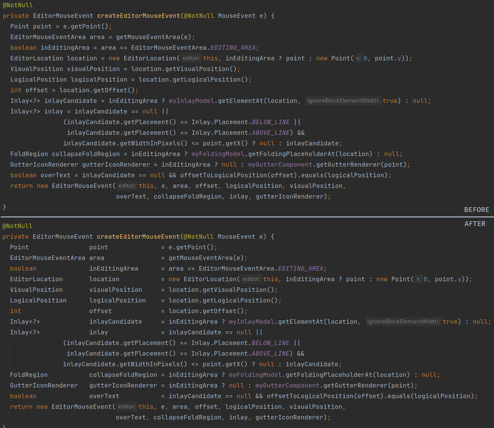
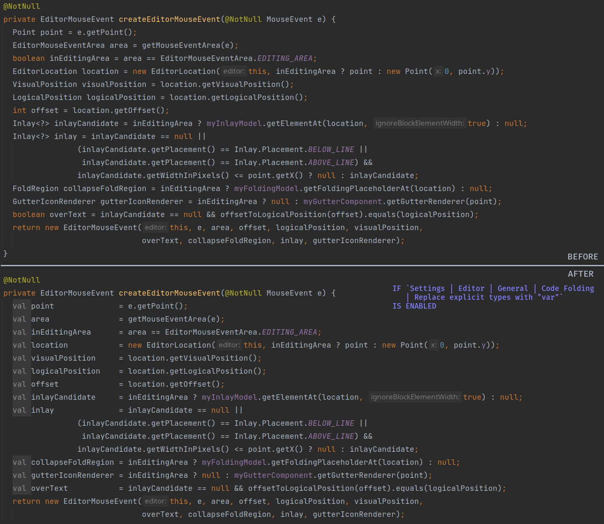
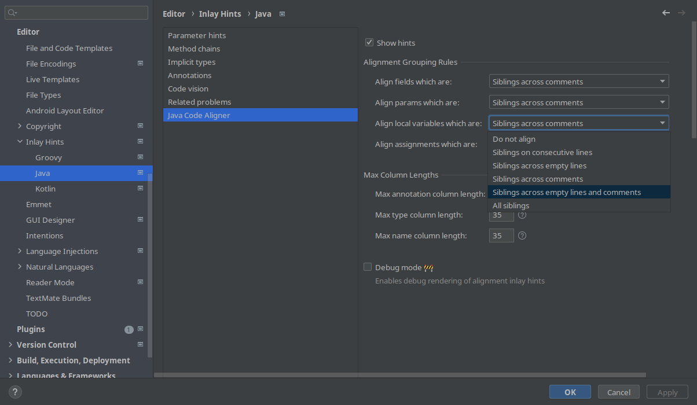
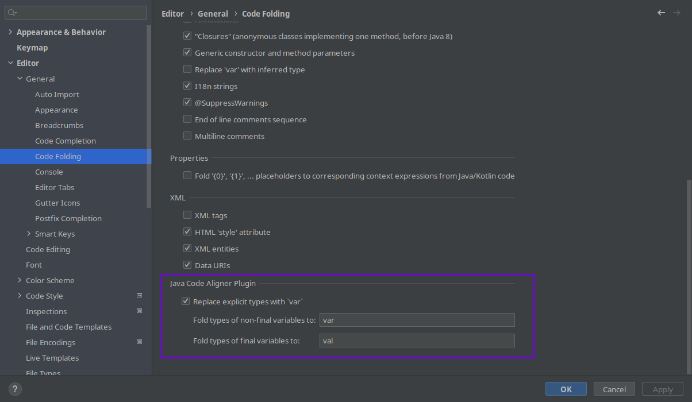

# Java Code Aligner

<!-- Plugin description -->
Provides displaying the Java code as aligned horizontally in columns without actual formatting of the code.

It mainly serves for _increasing code readability_ and _reducing tension_
when reading dozens of tightly placed code lines with different elements.

More formally the plugin provides:

- alignment of consecutive fields, local variables and params in columns of annotations, modifiers, types, names,
  initializers;
- alignment of consecutive assignments by the equal sign;
- pretty rich set of alignment settings in `File | Settings | Editor | Inlay Hints | Java | Java Code Aligner`.

Please note, that fields alignment is performed only if its modifiers are placed
in [the canonical order](https://docs.oracle.com/javase/specs/jls/se7/html/jls-8.html#jls-8.3.1).

From the technical side, plugin works by adding invisible inlay hints (like the ones shown as parameter names for method
calls), which can be made visible via `Enable debug mode` in settings above.

Additionally, the plugin provides **folding of explicit types** to `var` and `final var` for local variable
declarations, which can be enabled in `File | Settings | Editor | General | Code Folding | Java Code Aligner`.
<!-- Plugin description end -->

## Screenshots

### Fields alignment:

### Params alignment:

### Local variables declaration alignment:

### Local variables declaration with folded types alignment:

### Alignment settings:

### Local variables types folding settings:

## Installation

- Using IDE built-in plugin system:

  <kbd>Settings/Preferences</kbd> > <kbd>Plugins</kbd> > <kbd>Marketplace</kbd> > <kbd>Search for "
  intellij-java-code-aligner"</kbd> >
  <kbd>Install Plugin</kbd>

- Manually:

  Download the [latest release](https://github.com/bash-spbu/intellij-java-code-aligner/releases/latest) and install it manually using
  <kbd>Settings/Preferences</kbd> > <kbd>Plugins</kbd> > <kbd>⚙️</kbd> > <kbd>Install plugin from disk...</kbd>

---
Plugin based on the [IntelliJ Platform Plugin Template][template].

[template]: https://github.com/JetBrains/intellij-platform-plugin-template
